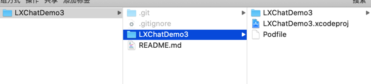

# LXChatDemo3
# 使用环信实现的自定义UI的即时通讯

1.非项目人员使用Https 下载项目源码

```
git clone https://github.com/SuLangXuan/LXChatDemo3.git
```

2.下载成功后，目录如下：



执行操作： cd 到Podfile所在文件夹 ，执行pod install 环信sdk，打开LXChatDemo3.xcworkspace，command+r 即可运行Demo

